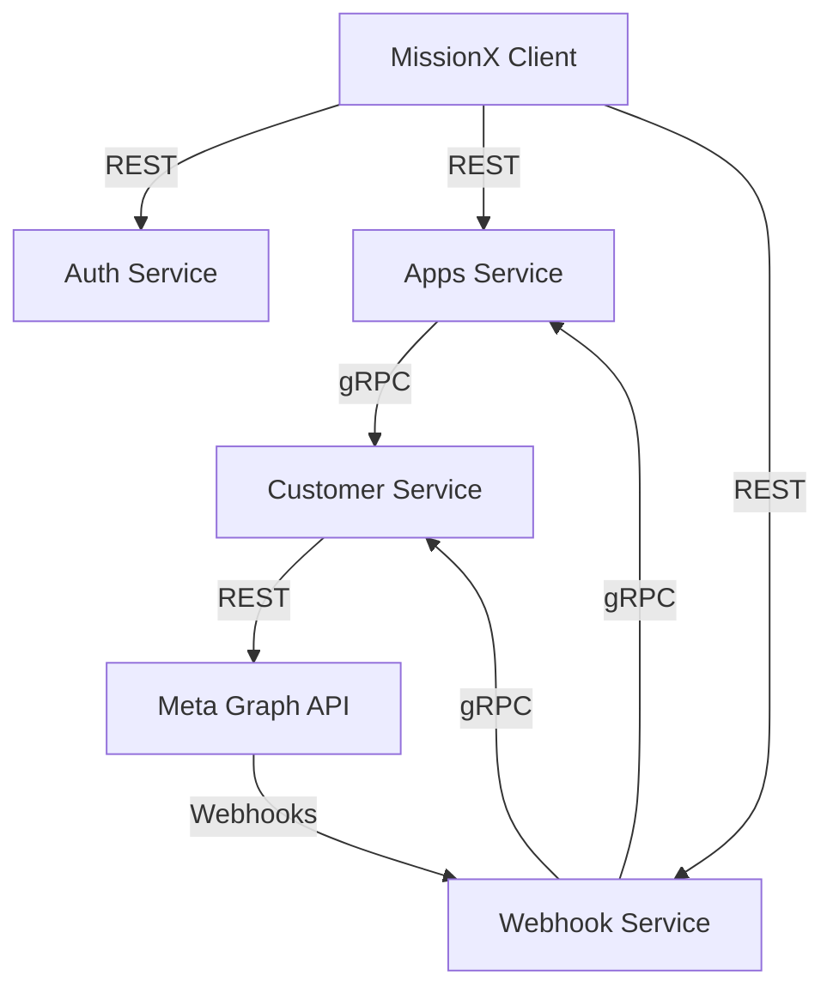

# Mission Microservices

Welcome to the Mission project, a scalable microservice architecture for managing apps, webhooks, and customers with Meta (Facebook/Instagram) integration.

## 🚀 System Architecture

The system consists of several specialized microservices communicating via REST (FastAPI) and gRPC.

| Service | Responsibility | Port (FastAPI) | Port (gRPC) |
|:---|:---|:---|:---|
| **[Authentications](./authentications)** | User Auth, JWT, Sessions | 8000 | N/A |
| **[Apps Service](./apps_service)** | App Mgmt, Templates, Flows | 8500 | 50051 |
| **[Webhook Service](./webhook-service)** | External Webhooks, Messages | 8006 | N/A (Client Only) |
| **[Customer Service](./customer-service)** | External Identities, Meta Profiles | 8007 | 50052 |
| **[MissionX Client](./missionx-client)** | Frontend Dashboard (Next.js) | 3000 | N/A |

## 🛠️ Connectivity & Interaction



### Communication Patterns
1. **REST (FastAPI)**: Used for client-to-service communication and external webhooks.
2. **gRPC**: Used for high-performance service-to-service communication (e.g., Webhook service querying App details).
3. **Database Isolation**: Each service has its own database (PostgreSQL) and cache (Redis) to ensure high availability and shared-nothing architecture.

## 🏁 How to Run

### 🐳 Running with Docker (Recommended)

Each service has its own `docker-compose.yml`. To run the entire stack:

1. **Infrastructure (Postgres/Redis)**:
   It is recommended to start the databases first within each service directory or use a shared network.
   
2. **Start Services**:
   Navigate to each directory and run:
   ```bash
   docker-compose up --build -d
   ```

### 💻 Running in Terminal (Development)

To run services manually, ensure you have Python 3.11+ and Redis/Postgres running.

#### 1. Authentications (Port 8000)
```bash
cd authentications
uvicorn app.main:app --host 0.0.0.0 --port 8000
```

#### 2. Apps Service (FastAPI: 8500, gRPC: 50051)
```bash
cd apps_service
# Run FastAPI
uvicorn app.main:app --host 0.0.0.0 --port 8500
# Run gRPC (Separate Process)
python -m app.grpc_server
```

#### 3. Webhook Service (Port 8006)
```bash
cd webhook-service
uvicorn app.main:app --host 0.0.0.0 --port 8006
```

#### 4. Customer Service (FastAPI: 8007, gRPC: 50052)
```bash
cd customer-service
# Run FastAPI
uvicorn app.main:app --host 0.0.0.0 --port 8007
# Run gRPC (Separate Process)
python app/grpc_main.py
```

#### 5. MissionX Client (Port 3000)
```bash
cd missionx-client
npm run dev
```

## 🔒 Security & Authentication

- **JWT (RS256)**: All services validate tokens issued by the Auth Service using JWKS.
- **Service-to-Service**: internal gRPC calls can be authenticated via `x-internal-token` metadata.

## 📝 Notes
- **FastAPI and gRPC are running separately** for Apps and Customer services.
- **Port Conflicts**: All services have been pre-configured with unique ports to avoid conflicts when running locally.
